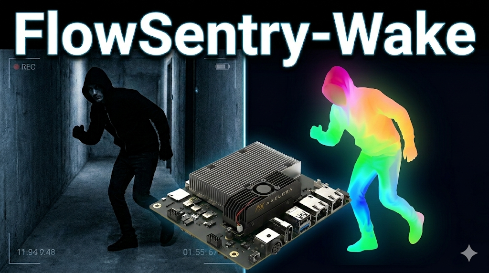

<p align="center">
  
</p>

# FlowSentry-Wake

[](#cn) [](#en)

FlowSentry-Wake 是一个面向边缘安防场景的低功耗、高鲁棒性 AI 哨兵系统，运行于 **Orange Pi 5 Plus + Metis M.2**。  
FlowSentry-Wake is an low-power, high-robustness AI edge sentry system for security, built on **Orange Pi 5 Plus + Metis M.2**.

演示视频 / Demo Video: https://www.youtube.com/watch?v=MPbFn8jpanw

---

<a id="cn"></a>
## 中文

### 项目定位

FlowSentry-Wake 面向低功耗安防场景，目标是在边缘设备上同时实现：

- 低功耗常驻
- 低误报
- 对抗/非标准目标鲁棒性

系统采用四阶段分层感知：

- `Stage 1 Standby`：低功耗运动触发（帧差/MOG2）
- `Stage 2 Triage`：光流/YOLO 快速筛查
- `Stage 3 Fusion`：双流融合与报警决策
- `Stage 4 Overlay/Validation`：可视化与场景验证

主状态机路径：`STANDBY -> FLOW_ACTIVE -> YOLO_VERIFY -> ALARM`

### 目录与归属

本仓库包含两类内容：

- 第一方（FlowSentry-Wake 自研）：
  - `flowsentry/`
  - `scripts/run_flowsentry_*.py`
  - `docs/flowsentry_*.md`
- 第三方（Axelera Voyager SDK 组件）：
  - `axelera/`, `ax_models/`, `operators/`, `tools/`, `trackers/`, `licenses/` 等

### 如何引入并使用 Axelera SDK

当前仓库是“同仓集成”模式，第三方 SDK 目录已在仓库中。

#### 准备开发环境（官方流程）

按官方安装文档执行：[`docs/tutorials/install.md`](docs/tutorials/install.md)。

核心命令：

```bash
./install.sh --all --media
source venv/bin/activate
axdevice list
```

说明：

- `install.sh` 会安装运行时、开发依赖与 Python 虚拟环境。
- 每次切换 SDK release 分支后，建议重新执行安装并重新激活环境。
- 复现本项目前，请将仓库内 `./weights/` 的内容复制到 `~/.cache/axelera/weights/`：

```bash
cp -r ./weights/. ~/.cache/axelera/weights/
```

1. 激活虚拟环境

```bash
source venv/bin/activate
```

2. 在仓库根目录运行（推荐）

```bash
export PYTHONPATH="$PWD:${PYTHONPATH}"
```

3. 运行 FlowSentry 脚本

```bash
python scripts/run_flowsentry_dual_probe.py --help
python scripts/run_flowsentry_flow_probe.py --help
python scripts/run_flowsentry_yolo_probe.py --help
```

#### EdgeFlowNet 部署与量化校准

在边缘设备（Metis NPU）上运行 EdgeFlowNet 之前，通常需要进行模型量化与部署准备：

1. **校准数据集准备**：
   项目根目录下提供了 `prepare_calib_data.py` 脚本。该脚本可将光流估计数据集转化成帧对的形式，用作部署时的校准集参考。
   
2. **完整部署流（主机端）**：
  关于如何在主机上完成模型导出，请参考专用部署仓库：
   [`https://github.com/linenmin/FlowSentry-Wake_EdgeFlowNet_Deployment`](https://github.com/linenmin/FlowSentry-Wake_EdgeFlowNet_Deployment)

### 快速开始

先准备环境变量与输出目录：

```bash
source venv/bin/activate
export RTSP="rtsp://<user>:<pass>@<ip>:554/av_stream/ch0"
export HA="http://<ha-ip>:8123/api/webhook/<webhook_id>"
mkdir -p artifacts/flowsentry/{dual_probe,yolo_probe,flow_probe}
```

1. 双流最终验证命令（RTSP + Overlay + HA）

```bash
python scripts/run_flowsentry_dual_probe.py \
  edgeflownet-opticalflow-raw \
  yolov8s-coco \
  "$RTSP" \
  --pipe gst \
  --frames 100 \
  --display \
  --native-display \
  --side-by-side \
  --overlay \
  --rtsp-latency 100 \
  --frame-rate 7 \
  --magnitude-threshold 6 \
  --min-region-area 120 \
  --max-flow-boxes 5 \
  --max-frame-age-s 1.2 \
  --jsonl-out artifacts/flowsentry/dual_probe/dual_probe_merged_600.jsonl \
  --summary-json artifacts/flowsentry/dual_probe/summary_merged_600.json \
  --acceptance-report artifacts/flowsentry/dual_probe/acceptance_report_merged_600.md \
  --summary-only \
  --save-video "ball.mp4" \
  --ha-webhook-enabled \
  --ha-webhook-url "$HA" \
  --ha-webhook-timeout 2.0 \
  --ha-webhook-cooldown-seconds 10 \
  --ha-no-object-delay-frames 5 \
  --ha-camera-name front_gate
```

用户需要重点关注：

- 三个位置参数：`flow_network`、`yolo_network`、`source($RTSP)`
- 产物文件：
  - `--jsonl-out`：逐帧记录
  - `--summary-json`：统计摘要
  - `--acceptance-report`：验收报告（Markdown）
  - `--save-video`：可视化证据视频
- HA 参数：`--ha-webhook-enabled` + `--ha-webhook-url` 为最小必需

2. YOLO 单独测试（仅语义流）

```bash
python scripts/run_flowsentry_yolo_probe.py \
  yolov8s-coco \
  "$RTSP" \
  --pipe gst \
  --frames 100 \
  --rtsp-latency 100 \
  --jsonl-out artifacts/flowsentry/yolo_probe/yolo_probe.jsonl \
  --summary-json artifacts/flowsentry/yolo_probe/summary.json \
  --summary-only \
  --overlay \
  --display
```

3. 光流单独测试（仅运动流）

```bash
python scripts/run_flowsentry_flow_probe.py \
  edgeflownet-opticalflow-raw \
  "$RTSP" \
  --pipe gst \
  --frames 100 \
  --rtsp-latency 100 \
  --frame-rate 7 \
  --magnitude-threshold 6 \
  --min-region-area 120 \
  --jsonl-out artifacts/flowsentry/flow_probe/flow_probe.jsonl \
  --summary-json artifacts/flowsentry/flow_probe/summary.json \
  --summary-only \
  --overlay \
  --native-display
```

4. Home Assistant 集成（最小步骤）

- 在 Home Assistant 创建 `webhook` 自动化（触发后播放告警音）
- 设置 `HA` 环境变量或显式传入 `--ha-webhook-url`
- 运行双流命令并开启 `--ha-webhook-enabled`
- 联调细节参考：[`docs/flowsentry_homeassistant_homepod_integration.md`](docs/flowsentry_homeassistant_homepod_integration.md)

开发与测试说明请见：[`docs/dev.md`](docs/dev.md)。

### 最小运行示例

只做最小链路验证时，可使用：

```bash
python scripts/run_flowsentry_dual_probe.py \
  edgeflownet-opticalflow-raw yolov8s-coco "$RTSP" \
  --display --overlay
```

### 版本信息

- 第三方基线：Voyager SDK `v1.5` 系列（参考 [RELEASE_NOTES.md](RELEASE_NOTES.md)）

### 版权与许可证

- 第三方 Axelera 组件：
  - 版权声明见 [LICENSE.txt](LICENSE.txt)（`© Axelera AI, 2025`）。
  - 使用条款遵循 Axelera EULA：<https://www.axelera.ai/eula>。
  - 该部分属于第三方专有许可（非开源许可）；本仓库对该部分不提供额外授权，使用与分发以 EULA 为准。
  - 开源依赖许可见 [`licenses/`](licenses)
- FlowSentry-Wake 自研部分：
  - 代码与文档许可：[`LICENSE`](LICENSE)（MIT）
  - 适用边界：[`LICENSE_SCOPE.md`](LICENSE_SCOPE.md)

### 相关文档

- 安装：[`docs/tutorials/install.md`](docs/tutorials/install.md)
- 推理：[`docs/reference/inference.md`](docs/reference/inference.md)
- 部署：[`docs/reference/deploy.md`](docs/reference/deploy.md)
- 场景验证：[`docs/flowsentry_scenario_validation.md`](docs/flowsentry_scenario_validation.md)（FlowSentry 场景验证 / Scenario Validation）
- Home Assistant 集成：[`docs/flowsentry_homeassistant_homepod_integration.md`](docs/flowsentry_homeassistant_homepod_integration.md)（FlowSentry 报警联动 Home Assistant + HomePod）
- 实时延迟优化：[`docs/flowsentry_latency.md`](docs/flowsentry_latency.md)（Flow Probe 实时延迟优化手册 / Flow Probe Real-Time Latency Optimization Guide）
- 开发与测试：[`docs/dev.md`](docs/dev.md)（Development Guide）

### 致谢

- EdgeFlowNet 项目：<https://github.com/pearwpi/EdgeFlowNet>
- Axelera 官方 Voyager SDK (v1.5)：<https://github.com/axelera-ai-hub/voyager-sdk/tree/release/v1.5>

---

<a id="en"></a>
## English

### Project Overview

FlowSentry-Wake targets low-power security workloads and is designed to balance:

- low power consumption
- low false positives
- robustness against adversarial/non-standard targets

Four-stage perception pipeline:

- `Stage 1 Standby`: low-power motion trigger (frame diff/MOG2)
- `Stage 2 Triage`: fast optical-flow/YOLO screening
- `Stage 3 Fusion`: dual-stream alarm decision
- `Stage 4 Overlay/Validation`: visualization and scenario validation

Primary FSM path: `STANDBY -> FLOW_ACTIVE -> YOLO_VERIFY -> ALARM`

### Repository Boundary

This repository includes:

- First-party (FlowSentry-Wake custom code):
  - `flowsentry/`
  - `scripts/run_flowsentry_*.py`
  - `docs/flowsentry_*.md`
- Third-party (Axelera Voyager SDK components):
  - `axelera/`, `ax_models/`, `operators/`, `tools/`, `trackers/`, `licenses/`, etc.

### How to Use the Axelera SDK

This repo currently uses an in-repo integration model: required SDK directories are already present.

#### Prepare Development Environment (Official Flow)

Follow the third-party official installation guide: [`docs/tutorials/install.md`](docs/tutorials/install.md).

Core commands:

```bash
./install.sh --all --media
source venv/bin/activate
axdevice list
```

Notes:

- `install.sh` installs runtime components, development dependencies, and the Python virtual environment.
- After switching SDK release branches, reinstall/re-activate the environment before running workflows.
- Before reproducing this project, copy everything under `./weights/` to `~/.cache/axelera/weights/`:

```bash
cp -r ./weights/. ~/.cache/axelera/weights/
```

1. Activate environment

```bash
source venv/bin/activate
```

2. Run from repository root (recommended)

```bash
export PYTHONPATH="$PWD:${PYTHONPATH}"
```

3. Run FlowSentry scripts

```bash
python scripts/run_flowsentry_dual_probe.py --help
python scripts/run_flowsentry_flow_probe.py --help
python scripts/run_flowsentry_yolo_probe.py --help
```

#### EdgeFlowNet Deployment & Calibration

Before running EdgeFlowNet on an edge device (Metis NPU), model quantization and deployment preparation are typically required:

1. **Calibration Dataset Preparation**:
The `prepare_calib_data.py` script is provided in the repository root. It serves as a reference to convert optical flow datasets into frame-pair formats to be used as a calibration set for deployment.

2. **Full Deployment Workflow (Host Side)**:
For detailed instructions on model exporting and conversion on the host machine, please refer to the dedicated deployment repository:
[`https://github.com/linenmin/FlowSentry-Wake_EdgeFlowNet_Deployment`](https://github.com/linenmin/FlowSentry-Wake_EdgeFlowNet_Deployment)

### Quick Start

Prepare variables and output directories:

```bash
source venv/bin/activate
export RTSP="rtsp://<user>:<pass>@<ip>:554/av_stream/ch0"
export HA="http://<ha-ip>:8123/api/webhook/<webhook_id>"
mkdir -p artifacts/flowsentry/{dual_probe,yolo_probe,flow_probe}
```

1. Final dual-stream command (RTSP + Overlay + HA)

```bash
python scripts/run_flowsentry_dual_probe.py \
  edgeflownet-opticalflow-raw \
  yolov8s-coco \
  "$RTSP" \
  --pipe gst \
  --frames 100 \
  --display \
  --native-display \
  --side-by-side \
  --overlay \
  --rtsp-latency 100 \
  --frame-rate 7 \
  --magnitude-threshold 6 \
  --min-region-area 120 \
  --max-flow-boxes 5 \
  --max-frame-age-s 1.2 \
  --jsonl-out artifacts/flowsentry/dual_probe/dual_probe_merged_600.jsonl \
  --summary-json artifacts/flowsentry/dual_probe/summary_merged_600.json \
  --acceptance-report artifacts/flowsentry/dual_probe/acceptance_report_merged_600.md \
  --summary-only \
  --save-video "ball.mp4" \
  --ha-webhook-enabled \
  --ha-webhook-url "$HA" \
  --ha-webhook-timeout 2.0 \
  --ha-webhook-cooldown-seconds 10 \
  --ha-no-object-delay-frames 5 \
  --ha-camera-name front_gate
```

What users should understand:

- Required positional args: `flow_network`, `yolo_network`, `source ($RTSP)`
- Output artifacts:
  - `--jsonl-out`: per-frame records
  - `--summary-json`: summary metrics
  - `--acceptance-report`: markdown acceptance report
  - `--save-video`: visual evidence video
- HA minimum flags: `--ha-webhook-enabled` + `--ha-webhook-url`

2. YOLO-only test

```bash
python scripts/run_flowsentry_yolo_probe.py \
  yolov8s-coco \
  "$RTSP" \
  --pipe gst \
  --frames 100 \
  --rtsp-latency 100 \
  --jsonl-out artifacts/flowsentry/yolo_probe/yolo_probe.jsonl \
  --summary-json artifacts/flowsentry/yolo_probe/summary.json \
  --summary-only \
  --overlay \
  --display
```

3. Optical-flow-only test

```bash
python scripts/run_flowsentry_flow_probe.py \
  edgeflownet-opticalflow-raw \
  "$RTSP" \
  --pipe gst \
  --frames 100 \
  --rtsp-latency 100 \
  --frame-rate 7 \
  --magnitude-threshold 6 \
  --min-region-area 120 \
  --jsonl-out artifacts/flowsentry/flow_probe/flow_probe.jsonl \
  --summary-json artifacts/flowsentry/flow_probe/summary.json \
  --summary-only \
  --overlay \
  --native-display
```

4. Home Assistant integration (minimum)

- Create a webhook automation in Home Assistant (play alarm audio on trigger)
- Set `HA` env var or pass `--ha-webhook-url`
- Run dual probe with `--ha-webhook-enabled`
- Integration details: [`docs/flowsentry_homeassistant_homepod_integration.md`](docs/flowsentry_homeassistant_homepod_integration.md)

For development and testing workflow, see [`docs/dev.md`](docs/dev.md).

### Minimal Runtime Example

For a minimal quick run:

```bash
python scripts/run_flowsentry_dual_probe.py \
  edgeflownet-opticalflow-raw yolov8s-coco "$RTSP" \
  --display --overlay
```

### Version Baseline

- FlowSentry-Wake: Stage 1-4 core pipeline implemented
- Third-party baseline: Voyager SDK `v1.5` series (see [RELEASE_NOTES.md](RELEASE_NOTES.md))

### Copyright and Licensing

- Third-party Axelera components:
  - Copyright notice in [LICENSE.txt](LICENSE.txt) (`© Axelera AI, 2025`).
  - Usage is subject to the Axelera EULA: <https://www.axelera.ai/eula>.
  - This third-party part is under a proprietary license (not an open-source license); this repository grants no additional rights beyond the EULA.
  - OSS dependency licenses under [`licenses/`](licenses)
- First-party FlowSentry-Wake code/docs:
  - code and documentation license: [`LICENSE`](LICENSE) (MIT)
  - boundary definition: [`LICENSE_SCOPE.md`](LICENSE_SCOPE.md)

### References

- Install: [`docs/tutorials/install.md`](docs/tutorials/install.md)
- Inference: [`docs/reference/inference.md`](docs/reference/inference.md)
- Deployment: [`docs/reference/deploy.md`](docs/reference/deploy.md)
- Scenario validation: [`docs/flowsentry_scenario_validation.md`](docs/flowsentry_scenario_validation.md) (FlowSentry Scenario Validation)
- Home Assistant integration: [`docs/flowsentry_homeassistant_homepod_integration.md`](docs/flowsentry_homeassistant_homepod_integration.md) (FlowSentry Alarm Integration with Home Assistant + HomePod)
- Real-time latency optimization: [`docs/flowsentry_latency.md`](docs/flowsentry_latency.md) (Flow Probe Real-Time Latency Optimization Guide)
- Development and testing: [`docs/dev.md`](docs/dev.md) (Development Guide)

### Acknowledgements

- EdgeFlowNet project: <https://github.com/pearwpi/EdgeFlowNet>
- Axelera official Voyager SDK (v1.5): <https://github.com/axelera-ai-hub/voyager-sdk/tree/release/v1.5>
